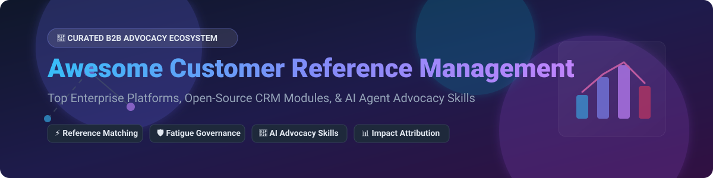

  

# 🚀 Awesome Customer Reference Management

  
  
  
  
  
  

## 📌 Executive Overview & Market Intelligence

> **📊 Market Size & Industry Dynamics**: The global B2B Customer Reference Management and Customer Advocacy Software market is estimated at **$1.2 Billion in 2026** and is growing at ~16.5% CAGR. The sector is **moderately fragmented**: commercial market leadership is dominated by specialized platforms like *Influitive*, *ReferenceEdge*, and *SlapFive*, alongside CRM giants (Salesforce), while a rapidly expanding open-source ecosystem is emerging at the AI Agent Skill and feedback portal layers.

This repository tracks prominent **SaaS platforms** and **open-source projects** in **Customer Reference Management (CRM)**, **Customer Advocacy Marketing**, and **B2B Peer Reference Automation**. These tools help marketing, sales enablement, and customer success teams systematically identify satisfied customer advocates, automate reference call scheduling, build case study pipelines, conduct peer reviews, manage advocate burnout/fatigue, and attribute reference calls to closed-won revenue impact.

---

## 💡 Table of Contents

- [🏢 SaaS & Hosted Commercial Platforms](#-saas--hosted-commercial-platforms)
- [🔓 Open-Source GitHub Projects](#-open-source-github-projects)
- [🤝 How to Contribute](#-how-to-contribute)
- [☕ Support & Community](#-support--community)
- [📈 Star History](#-star-history)
- [⚠️ Disclaimer](#%EF%B8%8F-disclaimer)

---

## 🏢 SaaS & Hosted Commercial Platforms

Below is a comparative, sorted list of top enterprise SaaS solutions in customer reference management, ordered by **Company Scale / Valuation / Estimated Revenue (Descending)**.

| Platform / Product 🛠️ | Company Scale & Valuation 📈 | Pricing Tier (Starting) 💵 | Free Tier / Trial Limit ⏱️ | Key Advocacy & Reference Features 🌟 |
| :--- | :--- | :--- | :--- | :--- |
| **[Influitive Advocates](https://influitive.com/)** | **~$238.1M Valuation** (~$22.7M Annual Revenue) | $1,499 / month (Enterprise tier quoted annually) | No free tier; 14-day custom sandbox trial on demo request | Gamified advocate hubs, customer reference tracking, peer review collection, and advocacy reward automation. |
| **[TechValidate](https://www.techvalidate.com/)** *(by SurveyMonkey / Momentive)* | **Acquired by SurveyMonkey** ($2.0B+ Parent Valuation) | $500 / month (Billed annually per admin team) | No free plan; 7-day automated interactive guided product demo | Automated customer outcome research, automated testimonial creation, and verified case study generation. |
| **[CustomerGauge References](https://customergauge.com/)** | **~$6.6M Revenue** ($2.5M Total Funding) | $950 / month (Account-Based B2B NPS Plan) | No free plan; 14-day free trial on selected NPS & reference modules | B2B Account-based NPS integration with automatic advocate identification and reference candidate scoring. |
| **[SlapFive](https://www.slapfive.com/)** | **~$2.1M Revenue** (Bootstrapped / Private) | $800 / month (Customer Advocacy Starter Suite) | No free tier; 14-day interactive sales trial upon request | Customer advocacy marketing platform, automated reference call matching, case study engine, and video testimonials. |
| **[ReferenceEdge](https://www.referenceedge.com/)** *(by Point of Reference)* | **Private SMB** (~$2.0M Estimated Revenue) | $499 / month (Native Salesforce AppExchange package) | No free tier; 30-day Salesforce AppExchange sandbox trial | Enterprise Salesforce-native reference database management, advocate request matching, and fatigue tracking. |
| **[Upside](https://upside.io/)** | **Early Stage Enterprise** (~$1.5M Estimated Revenue) | $600 / month (Annual Contract Base) | No free plan; 14-day live sandbox evaluation | Automated reference request coordination, peer review management, content distribution, and revenue attribution. |
| **[Base.ai References](https://base.ai/)** | **Seed Stage** (~$1.0M Estimated Revenue) | $16 / month (Base Starter Tier) | **Free tier available**: 100 free AI message credits & 2 automated workflows forever | AI-driven reference matching, automated sales request routing, and advocate availability scheduling. |

---

## 🔓 Open-Source GitHub Projects

Below is a curated selection of open-source tools, CRM foundations, feedback portals, and AI Agent Skills that enable building custom reference management and customer advocacy workflows. **Sorted by GitHub Stars_Count (Descending)**.

| Project & Repository 📦 | GitHub Stars_Count 🌟 | License 📄 | Primary Category / Architecture 🧱 | Key Features & Reference Capabilities 🚀 |
| :--- | :--- | :--- | :--- | :--- |
| **[Twenty](https://github.com/twentyhq/twenty)** |  | AGPL-3.0 | Modern Open-Source CRM | Extensible data model foundation for custom reference candidate objects, contact fatigue tracking, GraphQL APIs, and custom entity relations. |
| **[Fider](https://github.com/getfider/fider)** |  | AGPL-3.0 | Feedback Portal & Request Tracker | Open-source user feedback portal built with Go and React; used to identify highly engaged product champions and promoters. |
| **[Creme CRM](https://github.com/HybirdCorp/creme_crm)** |  | GPL-3.0 | Python/Django Entity CRM | Configurable entity/relationship architecture perfect for modeling complex advocate permissioning, NDA history, and customer reference logs. |
| **[Reference Operations Skill (gtm-agents)](https://github.com/gtmagents/gtm-agents)** |  | MIT | AI Agent Skill (Claude / MCP) | **Most complete open-source reference operations framework.** Standardized reference request forms, qualification criteria, matching logic, and follow-up checklists. |
| **[Advocacy Roster System Skill (gtm-agents)](https://github.com/gtmagents/gtm-agents)** |  | MIT | AI Agent Skill (Claude / MCP) | Scoring framework for advocate cohorts, engagement calendars, risk/burnout monitoring, compliance layers, and pipeline reporting. |
| **[Customer Advocacy Skill (varunk130)](https://github.com/varunk130/ai-gtm-skill-library)** |  | MIT | AI Agent Skill (AMPLIFY Framework) | Treats advocate pipeline as an inventory supply chain: advocate identification, reference call motion design, reward mechanics, and revenue attribution. |
| **[Quackback](https://github.com/QuackbackIO/quackback)** |  | AGPL-3.0 | MCP-enabled Feedback Portal | Next.js 16 feedback voting board and roadmap system with built-in MCP server for automated AI agent advocate identification. |
| **[CustomerDB Android](https://github.com/schorschii/customerdb-android)** |  | GPL-3.0 | Mobile Customer Database | Lightweight Android app with self-hosted MySQL sync, GDPR compliance tools, and advocate grouping for mobile sales enablement. |

---

## 🛠️ Framework for Assembling a Custom Open-Source System

To construct a production-ready, open-source Customer Reference Management stack:
1. **Data Infrastructure Layer**: Deploy **[Twenty](https://github.com/twentyhq/twenty)** or **[Creme CRM](https://github.com/HybirdCorp/creme_crm)** as the core entity database for tracking advocate accounts, NDAs, and reference activity limits.
2. **Advocate Sourcing Layer**: Host **[Quackback](https://github.com/QuackbackIO/quackback)** or **[Fider](https://github.com/getfider/fider)** to collect user feedback and automatically flag high-NPS promoters.
3. **Workflow & AI Orchestration Layer**: Connect **[Reference Operations Skill](https://github.com/gtmagents/gtm-agents)** and **[Advocacy Roster System Skill](https://github.com/gtmagents/gtm-agents)** into your AI Assistant (Claude, Cursor, or MCP Server) to handle reference request matching, availability verification, and fatigue governance.

---

## 🤝 How to Contribute

Contributions are welcome! Help us maintain the most comprehensive resource for B2B Customer Reference Management and Customer Advocacy.

1. 🍴 **Fork the Repository**
2. 📝 **Add/Edit Entries** in `README.md` following the table formats above.
3. 🔍 **Verify Data**: Ensure descriptions are factual, link to official domains/repos, and include accurate pricing/star data.
4. 📬 **Submit a Pull Request** with a clear title and summary of changes.

---

## ☕ Support & Community

If you find this repository helpful, please consider supporting the project:

- ⭐ **Star this repository** to help others discover it!
- 🔀 **Fork & Share** with your Customer Marketing and Sales Enablement teams.
- 💬 **Join our Discord Community**: 
- 💖 **Sponsor the Project**: If you would like to buy us a coffee and support continuous updates, visit our [GitHub Sponsor Dashboard](https://github.com/sponsors/ishandutta2007).

---

## 📈 Star History

---

## ⚠️ Disclaimer

- This is a **community-curated list** provided for informational purposes only.
- Customer reference management platforms process sensitive customer data; ensure proper legal permissions, consent tracking, and NDA compliance before launching customer advocacy programs.
- **Open-Source Reality**: There is currently no single out-of-the-box open-source application that fully replicates commercial suites like ReferenceEdge or SlapFive. Assembling a complete system requires combining open-source CRMs, feedback portals, and AI Agent Skills.

---

  <b>Built for B2B Customer Marketing Managers, Reference Operations Leaders, &amp; Revenue Officers.</b>

